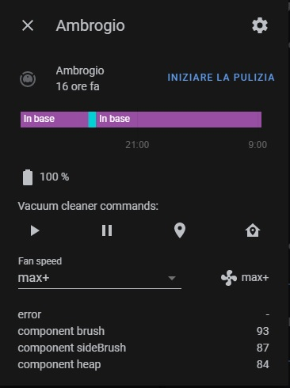
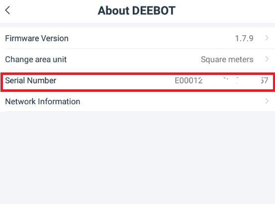

[](https://github.com/custom-components/hacs)
<br><a href="https://www.buymeacoffee.com/4nd3rs" target="_blank"></a>

# Home Assistant Custom Component for Ecovacs Deebot Ozmo 960/950/920



## Description
With this Home Assistant Custom Component you'll be able to 
* play/pause
* locate
* send to home
* clean[auto|map|area]
* track live map
* sensors
* and many more...

## Configuration
You can use it with this configuration

```
# required fields
deebot:
  username: YOUR_ECOVACS_USERNAME
  password: YOUR_ECOVACS_PASSWORD
  country: YOUR_TWO_LETTER_COUNTRY_CODE
  continent: YOUR_TWO_LETTER_CONTINENT_CODE
  deviceid: YOUR_ROBOT_ID
  # Optional
  live_map: True                    # Enable Live Map.. may cause issues on low power hardware | Default: True
  show_color_rooms: False           # Enable draw room colors as in the app | Default: False
  livemappath: 'www/live_map.png'   # Path where to save live_map
``` 

You can find your robot id under settings and "About Deebot"



### Sensors
This integration expose a number of sensors


### Live Map:

Add Camera in configuration.yaml

```
camera:
  - platform: generic
    name: Deebot_live_map
    still_image_url: "http://YOURLOCALIP:8123/local/live_map.png" #Example configuration for livemappath: 'www/live_map.png'
    verify_ssl: false
```

yaml component:
```
type: picture-entity
entity: vacuum.ambrogio
aspect_ratio: 50%
camera_image: camera.deebot_live_map
```

## Example commands:
You can clean certain area by specify it in rooms params, you can find room number under sensors section

```
# Clean Area
entity_id: vacuum.ambrogio
command: spot_area
params:
  rooms: 10,14
  cleanings: 1
```

```
# Customize Clean
# You can get coordinates with fiddler and the official APP [Advance User]
entity_id: vacuum.ambrogio
command: custom_area
params:
  coordinates: -1339,-1511,296,-2587
```

```
# Set Water Level
Possible amount values: low|medium|high|ultrahigh
example:

entity_id: vacuum.ambrogio
command: set_water
params:
  amount: ultrahigh
```

```
# Clean
Possible values: auto
example:

entity_id: vacuum.ambrogio
command: clean
params:
  type: auto
```