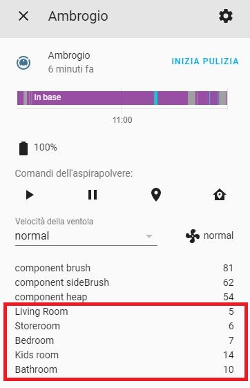

Home Assistant Custom Component for Ecovacs Deebot Ozmo 950


With this Home Assistant Custom Component you'll be able to 
* play/pause
* locate
* send to home
* clean[auto|map|area]

You can use it with this configuration

```
# required fields
vacuum:
  - platform: deebot
    username: YOUR_ECOVACS_USERNAME
    password: YOUR_ECOVACS_PASSWORD
    country: YOUR_TWO_LETTER_COUNTRY_CODE
    continent: YOUR_TWO_LETTER_CONTINENT_CODE
    deviceid: YOUR_ROBOT_ID
``` 

You can find your robot id under settings and "About Deebot"


You can clean certain area by specify it in CONTENT section (see blow example)
to make things easy i added a list of current saved rooms under robot date



Example to clean Bathroom and Kids Room:

```
# Clean Area
entity_id: vacuum.ambrogio
command: clean
params:
  act: 'start'
  content: 10,14
  count: 1
  type: 'spotArea'
```