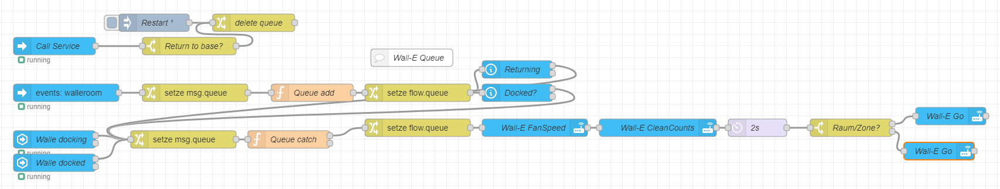

# Room Queuing (NodeRED)

This NodeRED Flow creates a cleaning queue.

Main advantage is the capability to add rooms on the fly without interrupting current jobs. Selecting a new room won't cancel the current cleaning job. Ideal for creating cleaning jobs by physical scene switches (like Aqara Opple) or conditions (like no motion in the room). Cleaning will be done first-in-first-out. The max length of the queue is 10 for a little girlfriend/wife/child safety.



Adding a room to the queue can be done by triggering the event `walleroom` with the following data. Injecting the data by replacing the event-node is possible, too.

```yaml
type: room
room: "{{ states.vacuum.wall_e.attributes.room_study}}"
count: 1
fan: normal
```

| event data | meaning                                                                                                                                                                 |
| ---------- | ----------------------------------------------------------------------------------------------------------------------------------------------------------------------- |
| type       | _room_ (for rooms) OR _zone_ (for custom zones using coordinates)                                                                                                       |
| room       | depending on the type ↑ <br> room: room number (numerical or dynamic as mentioned in the Readme below Templates)<br> zone: coordinates (e.g. _'-1339,-1511,296,-2587'_) |
| count      | _1_ or _2_ (cleaning quantity)                                                                                                                                          |
| fan        | fan speed in plain text                                                                                                                                                 |

Returning the robovac via `vacuum.return_to_base` or restarting NodeRED empties the queue.

## Name of the robovac

The robovac is called Wall-E in this example. To change the name, you need to change the entity id in all Home Assistant nodes (the blue ones) except the `Call Service` node. Renaming the event triggering an addition can be done in the `events: walleroom` node

## Issues

A new cleaning job is created every room. So the `last_clean_image` does only show the picture of the latest room.

## NodeRED Flow

```
[{"id":"e322f35b.77d14","type":"function","z":"4a944fd0.0aea7","name":"Queue catch","func":"if (msg.queue[0] == null) return [null, msg];\nelse {\nmsg.nextroom= msg.queue[0];\nfor (i=0; msg.queue[i] != null ;i++){  \nmsg.queue[i]= msg.queue[i+1];\n}\nreturn [msg, null];\n}","outputs":2,"noerr":0,"initialize":"","finalize":"","libs":[],"x":510,"y":300,"wires":[["944a9632.030ec8"],[]]},{"id":"6b764e8e.a9e6f","type":"server-events","z":"4a944fd0.0aea7","name":"","server":"62bd7c3c.e8e914","version":1,"event_type":"walleroom","exposeToHomeAssistant":false,"haConfig":[{"property":"name","value":""},{"property":"icon","value":""}],"waitForRunning":true,"outputProperties":[{"property":"payload","propertyType":"msg","value":"","valueType":"eventData"},{"property":"topic","propertyType":"msg","value":"$outputData(\"eventData\").event_type","valueType":"jsonata"}],"x":130,"y":220,"wires":[["6422bfc5.8fda3"]]},{"id":"73d11df7.97f704","type":"function","z":"4a944fd0.0aea7","name":"Queue add","func":"if (msg.queue[0] == null) {\n    msg.queue[0]= msg.payload.event\n    return [msg];\n}\n\nfor (i=9; msg.queue[i] == null ;i--){ \n    if (msg.queue[i-1] != null){\nmsg.queue[i]= msg.payload.event\nreturn [msg];\n    }}\n\n","outputs":1,"noerr":0,"initialize":"","finalize":"","libs":[],"x":550,"y":220,"wires":[["8ccea2f9.c117a"]]},{"id":"cd3abbab.6e8e78","type":"change","z":"4a944fd0.0aea7","name":"delete queue","rules":[{"t":"set","p":"queue","pt":"flow","to":"[null,null,null,null,null,null,null,null,null,null]","tot":"json"}],"action":"","property":"","from":"","to":"","reg":false,"x":450,"y":100,"wires":[[]]},{"id":"9e90e841.5791c8","type":"inject","z":"4a944fd0.0aea7","name":"Restart","props":[{"p":"queue","v":"[null,null,null,null,null,null,null,null,null,null]","vt":"json"}],"repeat":"","crontab":"","once":true,"onceDelay":"5","topic":"","x":280,"y":100,"wires":[["cd3abbab.6e8e78"]]},{"id":"12119484.65cb9b","type":"change","z":"4a944fd0.0aea7","name":"","rules":[{"t":"set","p":"queue","pt":"msg","to":"queue","tot":"flow"}],"action":"","property":"","from":"","to":"","reg":false,"x":330,"y":300,"wires":[["e322f35b.77d14"]]},{"id":"944a9632.030ec8","type":"change","z":"4a944fd0.0aea7","name":"","rules":[{"t":"set","p":"queue","pt":"flow","to":"queue","tot":"msg"}],"action":"","property":"","from":"","to":"","reg":false,"x":730,"y":280,"wires":[["648a462a.f05078"]]},{"id":"6422bfc5.8fda3","type":"change","z":"4a944fd0.0aea7","name":"","rules":[{"t":"set","p":"queue","pt":"msg","to":"queue","tot":"flow"}],"action":"","property":"","from":"","to":"","reg":false,"x":350,"y":220,"wires":[["73d11df7.97f704"]]},{"id":"8ccea2f9.c117a","type":"change","z":"4a944fd0.0aea7","name":"","rules":[{"t":"set","p":"queue","pt":"flow","to":"queue","tot":"msg"}],"action":"","property":"","from":"","to":"","reg":false,"x":730,"y":220,"wires":[["b92ee95a.a9bcc8","f7256e02.94227"]]},{"id":"cbd0ea46.ad3568","type":"server-events","z":"4a944fd0.0aea7","name":"Call Service","server":"62bd7c3c.e8e914","version":1,"event_type":"call_service","exposeToHomeAssistant":false,"haConfig":[{"property":"name","value":""},{"property":"icon","value":""}],"waitForRunning":true,"outputProperties":[{"property":"payload","propertyType":"msg","value":"","valueType":"eventData"}],"x":110,"y":140,"wires":[["3b4c86f9.6a8f6a"]]},{"id":"3b4c86f9.6a8f6a","type":"switch","z":"4a944fd0.0aea7","name":"Return to base?","property":"payload.event.service","propertyType":"msg","rules":[{"t":"eq","v":"return_to_base","vt":"str"}],"checkall":"true","repair":false,"outputs":1,"x":340,"y":140,"wires":[["cd3abbab.6e8e78"]]},{"id":"4aec9575.96167c","type":"server-state-changed","z":"4a944fd0.0aea7","name":"Walle docking","server":"62bd7c3c.e8e914","version":3,"exposeToHomeAssistant":false,"haConfig":[{"property":"name","value":""},{"property":"icon","value":""}],"entityidfilter":"vacuum.wall_e","entityidfiltertype":"exact","outputinitially":false,"state_type":"str","haltifstate":"returning","halt_if_type":"str","halt_if_compare":"is","outputs":2,"output_only_on_state_change":true,"for":"2","forType":"num","forUnits":"seconds","ignorePrevStateNull":false,"ignorePrevStateUnknown":false,"ignorePrevStateUnavailable":false,"ignoreCurrentStateUnknown":false,"ignoreCurrentStateUnavailable":false,"outputProperties":[{"property":"payload","propertyType":"msg","value":"","valueType":"entityState"},{"property":"data","propertyType":"msg","value":"","valueType":"eventData"},{"property":"topic","propertyType":"msg","value":"","valueType":"triggerId"}],"x":110,"y":300,"wires":[["12119484.65cb9b"],[]]},{"id":"648a462a.f05078","type":"api-call-service","z":"4a944fd0.0aea7","name":"Wall-E FanSpeed","server":"62bd7c3c.e8e914","version":3,"debugenabled":false,"service_domain":"vacuum","service":"set_fan_speed","entityId":"vacuum.wall_e","data":"{\"fan_speed\":\"{{nextroom.fan}}\"}","dataType":"json","mergecontext":"","mustacheAltTags":false,"outputProperties":[],"queue":"none","x":930,"y":280,"wires":[["af6f30aa.0f7d"]]},{"id":"9f3a7d63.1a37a","type":"switch","z":"4a944fd0.0aea7","name":"Raum/Zone?","property":"msg.nextroom.type","propertyType":"msg","rules":[{"t":"eq","v":"room","vt":"str"},{"t":"eq","v":"zone","vt":"str"}],"checkall":"true","repair":false,"outputs":2,"x":1470,"y":280,"wires":[["e33af8b2.3c7b98"],["155a4e4b.08dcb2"]]},{"id":"af6f30aa.0f7d","type":"api-call-service","z":"4a944fd0.0aea7","name":"Wall-E CleanCounts","server":"62bd7c3c.e8e914","version":3,"debugenabled":false,"service_domain":"vacuum","service":"send_command","entityId":"vacuum.wall_e","data":"{    \"command\": \"setCleanCount\",    \"params\": {        \"count\": {{nextroom.count}}    }}","dataType":"json","mergecontext":"","mustacheAltTags":false,"outputProperties":[],"queue":"none","x":1140,"y":280,"wires":[["1904cc73.0c0084"]]},{"id":"155a4e4b.08dcb2","type":"api-call-service","z":"4a944fd0.0aea7","name":"Wall-E Go","server":"62bd7c3c.e8e914","version":3,"debugenabled":false,"service_domain":"vacuum","service":"send_command","entityId":"vacuum.wall_e","data":"{\"command\":\"custom_area\",\"params\":{\"coordinates\":\"{{nextroom.room}}\"}}","dataType":"json","mergecontext":"","mustacheAltTags":false,"outputProperties":[],"queue":"none","x":1620,"y":320,"wires":[[]]},{"id":"e33af8b2.3c7b98","type":"api-call-service","z":"4a944fd0.0aea7","name":"Wall-E Go","server":"62bd7c3c.e8e914","version":3,"debugenabled":true,"service_domain":"vacuum","service":"send_command","entityId":"vacuum.wall_e","data":"{\"command\":\"spot_area\",\"params\":{\"rooms\":\"{{nextroom.room}}\"}}","dataType":"json","mergecontext":"","mustacheAltTags":false,"outputProperties":[],"queue":"none","x":1640,"y":260,"wires":[[]]},{"id":"f7256e02.94227","type":"api-current-state","z":"4a944fd0.0aea7","name":"Docked?","server":"62bd7c3c.e8e914","version":2,"outputs":2,"halt_if":"docked","halt_if_type":"str","halt_if_compare":"is","entity_id":"vacuum.wall_e","state_type":"str","blockInputOverrides":false,"outputProperties":[],"override_topic":false,"state_location":"payload","override_payload":"msg","entity_location":"data","override_data":"msg","x":900,"y":220,"wires":[["12119484.65cb9b"],[]]},{"id":"b92ee95a.a9bcc8","type":"api-current-state","z":"4a944fd0.0aea7","name":"Returning","server":"62bd7c3c.e8e914","version":2,"outputs":2,"halt_if":"returning","halt_if_type":"str","halt_if_compare":"is","entity_id":"vacuum.wall_e","state_type":"str","blockInputOverrides":false,"outputProperties":[],"override_topic":false,"state_location":"payload","override_payload":"msg","entity_location":"data","override_data":"msg","x":900,"y":180,"wires":[["12119484.65cb9b"],[]]},{"id":"9938b7ae.ccf6f8","type":"server-state-changed","z":"4a944fd0.0aea7","name":"Walle docked","server":"62bd7c3c.e8e914","version":3,"exposeToHomeAssistant":false,"haConfig":[{"property":"name","value":""},{"property":"icon","value":""}],"entityidfilter":"vacuum.wall_e","entityidfiltertype":"exact","outputinitially":false,"state_type":"str","haltifstate":"docked","halt_if_type":"str","halt_if_compare":"is","outputs":2,"output_only_on_state_change":true,"for":"2","forType":"num","forUnits":"seconds","ignorePrevStateNull":false,"ignorePrevStateUnknown":false,"ignorePrevStateUnavailable":false,"ignoreCurrentStateUnknown":false,"ignoreCurrentStateUnavailable":false,"outputProperties":[{"property":"payload","propertyType":"msg","value":"","valueType":"entityState"},{"property":"data","propertyType":"msg","value":"","valueType":"eventData"},{"property":"topic","propertyType":"msg","value":"","valueType":"triggerId"}],"x":110,"y":340,"wires":[["12119484.65cb9b"],[]]},{"id":"1904cc73.0c0084","type":"delay","z":"4a944fd0.0aea7","name":"2s","pauseType":"delay","timeout":"2","timeoutUnits":"seconds","rate":"1","nbRateUnits":"1","rateUnits":"second","randomFirst":"1","randomLast":"5","randomUnits":"seconds","drop":false,"x":1310,"y":280,"wires":[["9f3a7d63.1a37a"]]},{"id":"9dc0863c.5bbb68","type":"comment","z":"4a944fd0.0aea7","name":"Wall-E Queue","info":"","x":720,"y":160,"wires":[]},{"id":"62bd7c3c.e8e914","type":"server","name":"Home Assistant","version":1,"legacy":false,"addon":true,"rejectUnauthorizedCerts":true,"ha_boolean":"y|yes|true|on|home|open","connectionDelay":false,"cacheJson":true}]
```

Feel free to adapt this example, if you find issues. If interested, more robovac-handling flows (e.g. error handling, occupancy-dependent auto cleaning) can be shared.
