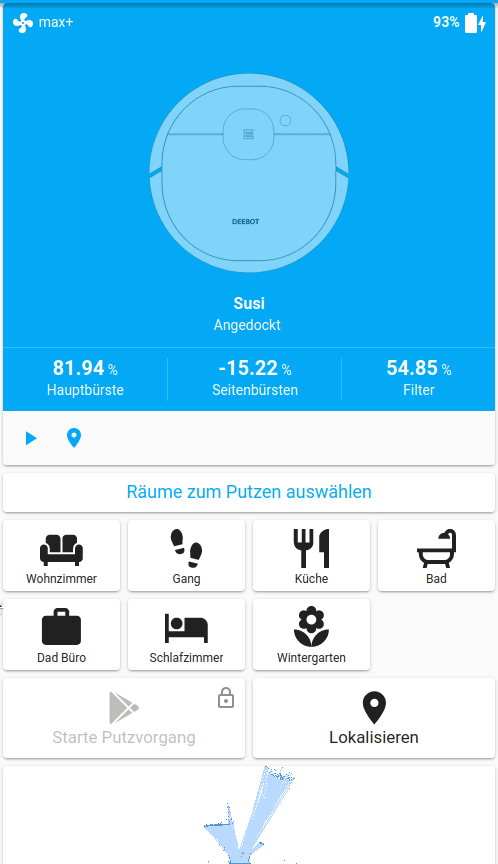

# UI advanced example

Main feature is ability to specify via UI the order of the cleaned rooms.
Thanks to @aidbish for the initial idea.



## Setup

For this setup to work, you need some custom components (all available via HACS)

- [Variables](https://github.com/Wibias/hass-variables)
- [Vacuum-card](https://github.com/denysdovhan/vacuum-card)
- [Button-card](https://github.com/custom-cards/button-card)

## Configuration

This example needs also a backend configuration for the templates and scripts.

## Backend (configuration.yaml)

```yaml
---
# Home Assistant Custom Component for Ecovacs Deebot Ozmo 960/950/920

logger:
  logs:
    homeassistant.components.vacuum: debug
    custom_components.deebot: debug
    deebotozmo: debug

script:
  deebot_clean:
    description: Start a deebot cleaning task
    variables:
      # The queue variable
      queue: variable.deebot_susi_queue
      vacuum_bot: vacuum.susi
    sequence:
      - alias: Get room numbers
        variables:
          # See for appending to list
          # https://github.com/home-assistant/core/issues/33678#issuecomment-609424851
          rooms: >-
            
            
            
              
            
            {{ data.rooms | join(",") }}
      - alias: Send cleaning job to vacuum
        service: vacuum.send_command
        data:
          entity_id: "{{ vacuum_bot }}"
          command: spot_area
          params:
            rooms: "{{ rooms }}"
            cleanings: 1

  deebot_room_queue:
    description: Add/Remove a room from the queue
    fields:
      queue:
        description: The queue variable
        example: deebot_susi_queue
      room:
        description: Room, which should be removed or added
        example: kitchen
    sequence:
      - service: variable.set_variable
        data:
          variable: "{{ queue }}"
          value: >-
            
            
              {{ room }}
            
              {{ queue | reject("eq", room) | list | join(",")}}
            
              {{ (queue + [room]) | join(",") }}
            

recorder:
  exclude:
    entities:
      - variable.deebot_susi_queue
      - script.deebot_room_queue
    entity_globs:
      - sensor.deebot_susi_queue_*

automation:
  - id: ba4d70a1-712e-488b-be78-316d65436ba1
    alias: Reset variable.deebot_susi_queue
    trigger:
      - platform: homeassistant
        event: start
        id: Home Assistant Start
    action:
      - service: variable.set_variable
        data:
          variable: deebot_susi_queue
          value: ""
    mode: single

variable:
  deebot_susi_queue:
    name: Susi Raum Reihenfolge
    value: ""
    restore: false

# Room name comes from the integration to match attribute names
template:
  unique_id: deebot_susi_queue
  trigger:
    platform: state
    entity_id: variable.deebot_susi_queue
  sensor:
    - unique_id: room_living_room
      name: deebot_susi_queue_room_living_room
      state: >
        
        {{ queue.index('room_living_room')+1 if 'room_living_room' in queue else 0 }}

    - unique_id: room_kitchen
      name: deebot_susi_queue_room_kitchen
      state: >
        
        {{ queue.index('room_kitchen')+1 if 'room_kitchen' in queue else 0 }}

    - unique_id: room_corridor
      name: deebot_susi_queue_room_corridor
      state: >
        
        {{ queue.index('room_corridor')+1 if 'room_corridor' in queue else 0 }}

    - unique_id: room_bathroom
      name: deebot_susi_queue_room_bathroom
      state: >
        
        {{ queue.index('room_bathroom')+1 if 'room_bathroom' in queue else 0 }}

    - unique_id: room_study
      name: deebot_susi_queue_room_study
      state: >
        
        {{ queue.index('room_study')+1 if 'room_study' in queue else 0 }}

    - unique_id: room_bedroom
      name: deebot_susi_queue_room_bedroom
      state: >
        
        {{ queue.index('room_bedroom')+1 if 'room_bedroom' in queue else 0 }}

    - unique_id: room_sunroom
      name: deebot_susi_queue_room_sunroom
      state: >
        
        {{ queue.index('room_sunroom')+1 if 'room_sunroom' in queue else 0 }}
```

### UI configuration

```yaml
type: vertical-stack
cards:
  - type: custom:vacuum-card
    entity: vacuum.susi
    stats:
      default:
        - entity_id: sensor.susi_brush
          unit: "%"
          subtitle: Hauptbürste
        - entity_id: sensor.susi_sidebrush
          unit: "%"
          subtitle: Seitenbürsten
        - entity_id: sensor.susi_heap
          unit: "%"
          subtitle: Filter
      cleaning:
        - entity_id: sensor.susi_stats_area
          unit: m²
          subtitle: Geputzte Fläche
        - entity_id: sensor.susi_stats_time
          unit: Minuten
          subtitle: Reinigungsdauer
    show_status: true
    show_toolbar: true
    compact_view: false
    image: /local/deebot950.svg
  - type: custom:button-card
    color: auto-no-temperature
    name: Räume zum Putzen auswählen
    styles:
      card:
        - font-size: 18px
        - height: 30px
      name:
        - color: var(--primary-color)
  - type: horizontal-stack
    cards:
      - type: custom:button-card
        entity: sensor.deebot_susi_queue_room_living_room
        icon: mdi:sofa
        name: Wohnzimmer
        state:
          - styles:
              card:
                - background-color: var(--primary-color)
            operator: ">="
            value: 1
        styles:
          card:
            - font-size: 12px
          grid:
            - position: relative
          custom_fields:
            notification:
              - display: |
                  [[[
                    if (entity.state == "0")
                      return "none";
                    return "block";
                  ]]]
              - position: absolute
              - right: 5%
              - top: 5%
              - height: 20px
              - width: 20px
              - font-size: 20px
              - font-weight: bold
              - line-height: 20px
        custom_fields:
          notification: |
            [[[ return entity.state ]]]
        tap_action:
          action: call-service
          service: script.deebot_room_queue
          service_data:
            queue: deebot_susi_queue
            room: room_living_room
      - type: custom:button-card
        entity: sensor.deebot_susi_queue_room_corridor
        icon: mdi:shoe-print
        name: Gang
        state:
          - styles:
              card:
                - background-color: var(--primary-color)
            operator: ">="
            value: 1
        styles:
          card:
            - font-size: 12px
          grid:
            - position: relative
          custom_fields:
            notification:
              - display: |
                  [[[
                    if (entity.state == "0")
                      return "none";
                    return "block";
                  ]]]
              - position: absolute
              - right: 5%
              - top: 5%
              - height: 20px
              - width: 20px
              - font-size: 20px
              - font-weight: bold
              - line-height: 20px
        custom_fields:
          notification: |
            [[[ return entity.state ]]]
        tap_action:
          action: call-service
          service: script.deebot_room_queue
          service_data:
            queue: deebot_susi_queue
            room: room_corridor
      - type: custom:button-card
        entity: sensor.deebot_susi_queue_room_kitchen
        icon: mdi:silverware-fork-knife
        name: Küche
        state:
          - styles:
              card:
                - background-color: var(--primary-color)
            operator: ">="
            value: 1
        styles:
          card:
            - font-size: 12px
          grid:
            - position: relative
          custom_fields:
            notification:
              - display: |
                  [[[
                    if (entity.state == "0")
                      return "none";
                    return "block";
                  ]]]
              - position: absolute
              - right: 5%
              - top: 5%
              - height: 20px
              - width: 20px
              - font-size: 20px
              - font-weight: bold
              - line-height: 20px
        custom_fields:
          notification: |
            [[[ return entity.state ]]]
        tap_action:
          action: call-service
          service: script.deebot_room_queue
          service_data:
            queue: deebot_susi_queue
            room: room_kitchen
      - type: custom:button-card
        entity: sensor.deebot_susi_queue_room_bathroom
        icon: mdi:shower
        name: Bad
        state:
          - styles:
              card:
                - background-color: var(--primary-color)
            operator: ">="
            value: 1
        styles:
          card:
            - font-size: 12px
          grid:
            - position: relative
          custom_fields:
            notification:
              - display: |
                  [[[
                    if (entity.state == "0")
                      return "none";
                    return "block";
                  ]]]
              - position: absolute
              - right: 5%
              - top: 5%
              - height: 20px
              - width: 20px
              - font-size: 20px
              - font-weight: bold
              - line-height: 20px
        custom_fields:
          notification: |
            [[[ return entity.state ]]]
        tap_action:
          action: call-service
          service: script.deebot_room_queue
          service_data:
            queue: deebot_susi_queue
            room: room_bathroom
  - type: horizontal-stack
    cards:
      - type: custom:button-card
        entity: sensor.deebot_susi_queue_room_study
        icon: mdi:briefcase
        name: Dad Büro
        state:
          - styles:
              card:
                - background-color: var(--primary-color)
            operator: ">="
            value: 1
        styles:
          card:
            - font-size: 12px
          grid:
            - position: relative
          custom_fields:
            notification:
              - display: |
                  [[[
                    if (entity.state == "0")
                      return "none";
                    return "block";
                  ]]]
              - position: absolute
              - right: 5%
              - top: 5%
              - height: 20px
              - width: 20px
              - font-size: 20px
              - font-weight: bold
              - line-height: 20px
        custom_fields:
          notification: |
            [[[ return entity.state ]]]
        tap_action:
          action: call-service
          service: script.deebot_room_queue
          service_data:
            queue: deebot_susi_queue
            room: room_study
      - type: custom:button-card
        entity: sensor.deebot_susi_queue_room_bedroom
        icon: mdi:bed
        name: Schlafzimmer
        state:
          - styles:
              card:
                - background-color: var(--primary-color)
            operator: ">="
            value: 1
        styles:
          card:
            - font-size: 12px
          grid:
            - position: relative
          custom_fields:
            notification:
              - display: |
                  [[[
                    if (entity.state == "0")
                      return "none";
                    return "block";
                  ]]]
              - position: absolute
              - right: 5%
              - top: 5%
              - height: 20px
              - width: 20px
              - font-size: 20px
              - font-weight: bold
              - line-height: 20px
        custom_fields:
          notification: |
            [[[ return entity.state ]]]
        tap_action:
          action: call-service
          service: script.deebot_room_queue
          service_data:
            queue: deebot_susi_queue
            room: room_bedroom
      - type: custom:button-card
        entity: sensor.deebot_susi_queue_room_sunroom
        icon: mdi:flower
        name: Wintergarten
        state:
          - styles:
              card:
                - background-color: var(--primary-color)
            operator: ">="
            value: 1
        styles:
          card:
            - font-size: 12px
          grid:
            - position: relative
          custom_fields:
            notification:
              - display: |
                  [[[
                    if (entity.state == "0")
                      return "none";
                    return "block";
                  ]]]
              - position: absolute
              - right: 5%
              - top: 5%
              - height: 20px
              - width: 20px
              - font-size: 20px
              - font-weight: bold
              - line-height: 20px
        custom_fields:
          notification: |
            [[[ return entity.state ]]]
        tap_action:
          action: call-service
          service: script.deebot_room_queue
          service_data:
            queue: deebot_susi_queue
            room: room_sunroom
      - type: custom:button-card
        color_type: blank-card
  - type: horizontal-stack
    cards:
      - type: custom:button-card
        color: var(--disabled-text-color)
        entity: variable.deebot_susi_queue
        icon: mdi:google-play
        name: Starte Putzvorgang
        tap_action:
          action: call-service
          service: script.deebot_clean
        lock:
          enabled: |
            [[[ 
              return !entity.state || 
                entity.state.length === 0 ||
                states['vacuum.susi'].state !== 'docked'
            ]]]
          exemptions: []
        styles:
          card:
            - height: 80px
            - color: var(--disabled-text-color)
          lock:
            - color: var(--primary-text-color)
        state:
          - operator: template
            value: |
              [[[ return states['vacuum.susi'].state !== 'docked' ]]]
            name: Putze...
            icon: mdi:cog
            spin: true
          - operator: template
            value: |
              [[[ return (entity.state || entity.state.length > 0) ]]]
            styles:
              card:
                - color: var(--text-color)
              icon:
                - color: var(--text-color)
      - type: custom:button-card
        color: auto
        icon: mdi:map-marker
        name: Lokalisieren
        tap_action:
          action: call-service
          service: vacuum.locate
          service_data:
            entity_id: vacuum.susi
        styles:
          card:
            - height: 80px
            - background-color: var(-color)
  - type: picture-entity
    entity: camera.susi_livemap
    tap_action:
      action: none
    hold_action:
      action: none
    show_state: false
    show_name: false
    card_mod:
      style:
        hui-image$: |
          img {
            max-height: 500px;
            width: auto;
            margin: auto;
          }
```

If someone finds an easier solution to configure the same, please feel free to adopt this example.
