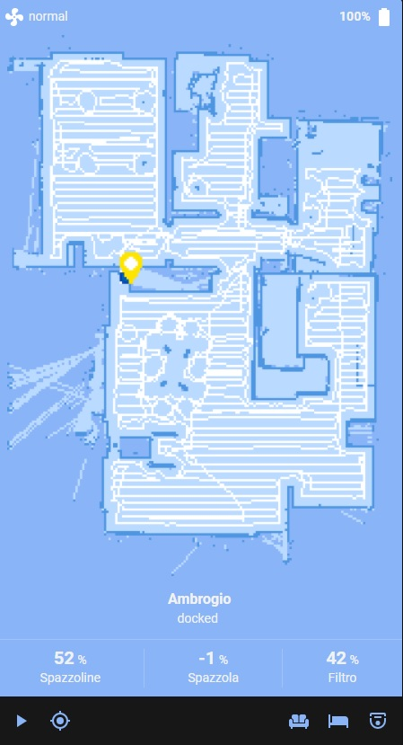

# Simple UI Example

A suggested custom lovelace card that i use is: vacuum-card by denysdovhan link: https://github.com/denysdovhan/vacuum-card

## Configuration:

```yaml
type: 'custom:vacuum-card'
entity: vacuum.YOURROBOTNAME
image: default
compact_view: false
show_name: true
show_toolbar: true
show_status: true
stats:
  default:
    - entity_id: sensor.YOURROBOTNAME_sidebrush
      unit: '%'
      subtitle: Side Brush
    - entity_id: sensor.YOURROBOTNAME_brush
      unit: '%'
      subtitle: Main Brush
    - entity_id: sensor.YOURROBOTNAME_heap
      unit: '%'
      subtitle: Heap
  cleaning:
    - entity_id: sensor.YOURROBOTNAME_stats_area
      unit: m2
      subtitle: Area
    - entity_id: sensor.YOURROBOTNAME_stats_time
      unit: min
      subtitle: Time
actions:
  - service: script.CLEAN_LIVINGROOM
    icon: 'mdi:sofa'
  - service: script.CLEAN_BEDROOM
    icon: 'mdi:bed-empty'
  - service: script.CLEAN_ALL
    icon: 'mdi:robot-vacuum-variant'
map: camera.ROBOTNAME_liveMap
```

Something like this should be the result:

